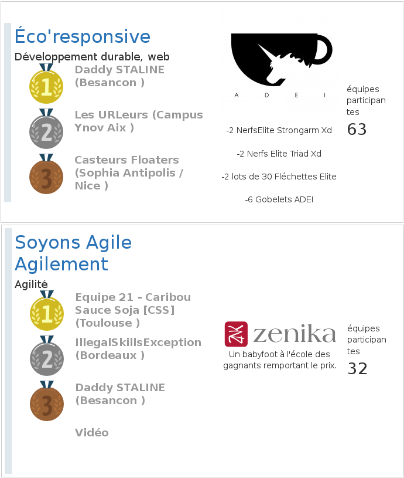

# Nuit Info 2015 - Alertes

Participation 2015 à la [Nuit de l'Info](http://nuitdelinfo.com/), le thème de cette année était : [urgence et réseaux sociaux](http://nuitdelinfo.com/nuitinfo/_media/la_nuit_de_l_info_2015_-_sujet.pdf).  

## La Nuit de l'Info 2015, c'est...

* 2847 participants,
* 366 équipes,
* sur 45 sites,
* 100 écoles,
* et 32 défis.

## Equipe

Chef : [Antoine Lavier](https://github.com/N0un "Page github d'Antoine")  
Les membres :
* [Naum Spaseski](https://github.com/nomce "Page github de Naum")
* [Kevin Boulala](https://github.com/KevBP "Page github de Kevin")
* [Jordan Martin](https://github.com/jmartin20 "Page github de Jordan")

Nous sommes en Master 2 Informatique à l'Université de Franche Comté. Naum et Jordan sont issus de la spécialité Conception et développement de logiciels sûrs (CODES), Antoine et Kevin de la spécialité Systèmes distribués et réseaux (SDR).  

## Les défis

## Les autres équipes de Besançon

*Cette section sera complétée si d'autres groupes rendent publiques leurs travaux*

## Les sponsors

